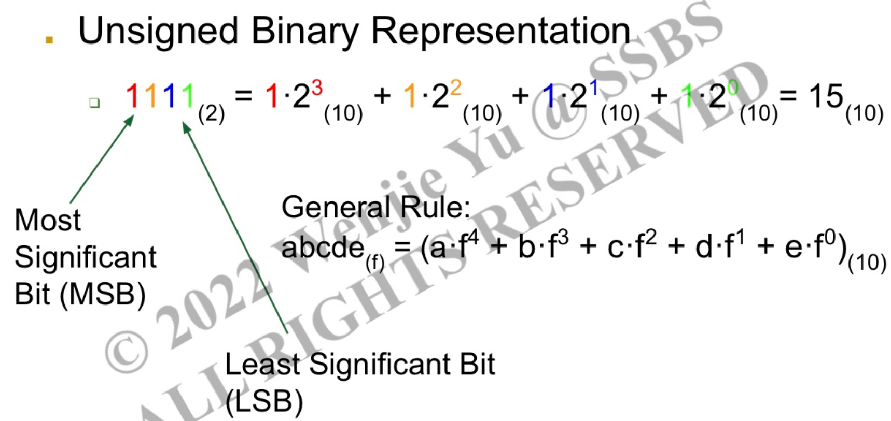
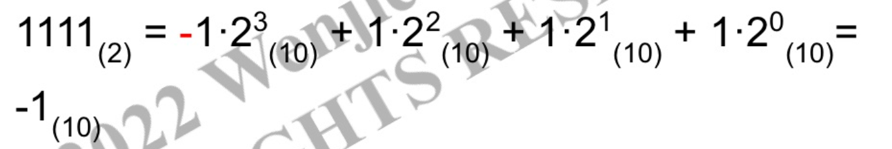
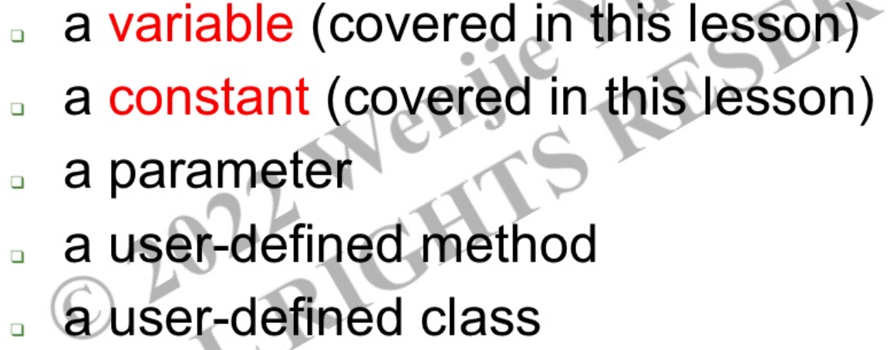
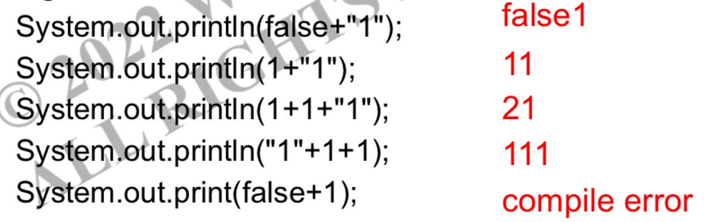
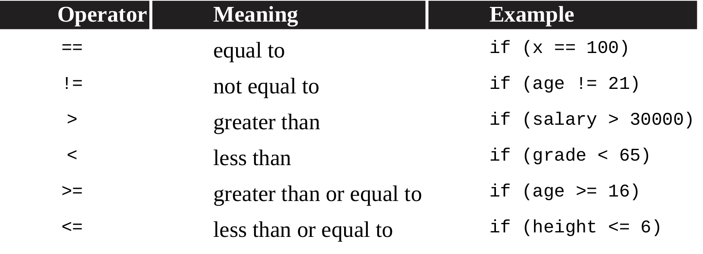
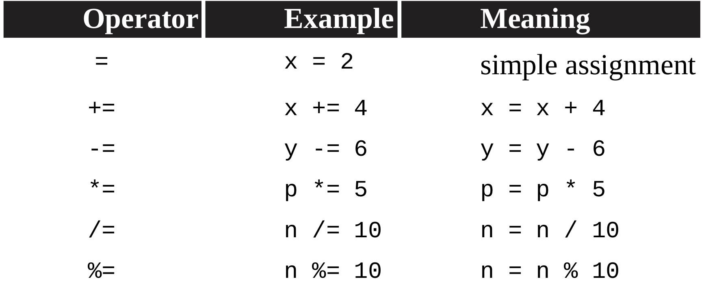
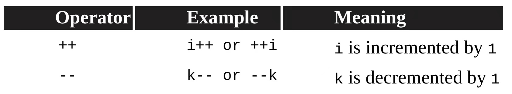
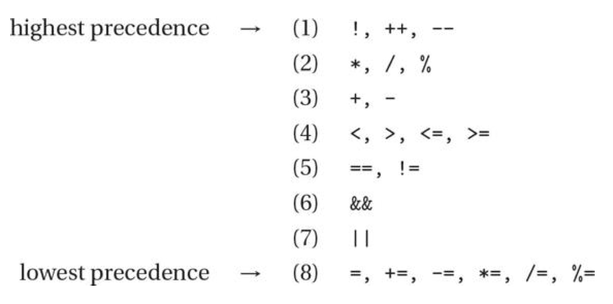

# Lesson 1-5

10-3 蒋韵涵Ana

## - Java Program Template

### Class:

```java
//template
[public/private] + class + [Classname]{ 

}

//Eg
public class Kumo{
    /*Code*/
}
```

        *Classname 开头字母建议大写*

### Method

```java
//template
[public/private] + [static/null] + [int/void/etc.(ReturnType)] 
    + [Methodname] + (parameter list) + {

 }

//Eg.
public static void Kumo(String csa, double ap){

}
```

1. **access specifier**: public/private, 决定是否能在其他class(client class)中直接使用此method

2. **static**: 添加与否决定method是属于Object还是整个Class(static or instance)
   
   1. 不写static就是instance
   
   2. Eg1. private int a = 0;
      
      - private对应access specifier - 代表这个int无法在其他class直接使用
      
      - 没有写static就代表是instance
      
      - 所以a是一个private instance
   
   3.  Eg2. 创建一个Class Car
      
      - 在Car class中，change_price() 就会是instance method， 因为每个车子价格都会不一样, 所以我们在改价格时也是改每个object(每个车)各自的价格，因而method不属于整个Car Class
      
      - 但是如果你很牛，你要改变世界，比如把世界上所有汽车都改成八个轮子的，那么此时change_wheels()就是static method，因为这个改变是会改变所有属于Car类型的东西
      
      - （详见后面Class&Object部分）

3. **ReturnType**: 返回类型，primitive type/object, void就不返回（可以理解为只是做了一个动作）

4. **parameter**: take-in

### Constructor

- 创建一个属于Class的object

```java
//template
public [Classname]{

}

//Eg.
public BankAccount{
    /* Code */
}
```

        *创建了一个BankAccount*的object

### Main Method

```java
public static void main(String[] args){
    /* Code */
}
```


## - Error & Exception

### Compile-Time Error / Syntax Error

Sth is wrong according to the rules of language and the compiler finds it.

Eg. **s**ystem.out.print("a"); --> **S**ystem.out.print("a");

### Run-Time Exception

Errors detected by the program during execution, which causes th eprogram to terminate before finishing execution

Eg. 

| Exception                       | Example/Meaning                               |
| - | - |
| ArthemeticException             | division by 0                                 |
| NullPointerException            | method call for an object whose value is null |
| ArrayIndexOutOfBoundsException  | int[] kumo = {1,2,3}; \newline int wrong = a[4];  |
| IndexOutOfBoundsException       | 和上面同理                                         |
| StringIndexOutOfBoundsException | 和上面同理                                         |

### Logic Error

Error that causes the program to produce an unexpected output

*不影响程序正常运行*


## - Output

- System.out.**print**() & **println**()

- Use \ in front of signs to include signs into the Strng literal - for signs that are specific(eg. " ") .
  
  - ```java
    //Eg.
    
    System.out.print("Kumo is \"happy\". ")
    //Output: Kumo is "happy".
    ```

- Escape Sequence

- 

- Comment
  
  - // ： for a single current line
  
  - /*... */ : multi-lines


## - Built-in(Primitive Types)

Start with a **lower case** letter

### Types

- int:  -2^31 ~ 2^31-1

- double

- boolean

### 强转

- ```
  //Eg.
  
  int a = 1;
  double b = (double)a; 
  
  // (type) variable
  ```

### Storage

- 1 byte = 8 bits

- int : 4 bytes

- double: 8 bytes

- boolean: 1 bit

- *注意Overflow - result out of range*， 因为有storage限制 - 属于Logic Error

### Binary Number



MSB: the sign of the binary number - 1(negative), 0(positive)

- **2's complement representation**
  
  - negative - 1 as the sign
    
    


## - Variable&Constants

### Identifier



*cannot be a keyword, eg. double double = 2.3*

### Variable

Must be declared and initialized before using it

Can be changed

```java
//Eg.
int a=b=1;
a=2;
//最终：a=2, b=1 
```

### Constants

Constant name is all **CAPITLIZED**

Use the keyword **final**

```java
//Eg. 
final double PI = 3.14
```


## - Expression

### Types


### Arthemetic Expression

| Operation       | Symbol |
|-----------------|--------|
| Addition        | +      |
| Subtraction     | -      |
| Multiplication  | *      |
| Division        | /      |
| Modulus         | %      |

*For an operation involving a double and int, int is promoted to a double*

Eg. double a = 3.5 + 2;

### Truncation - int/int
```java
int a = 1/2; // -> 0
int a = 1/2*1; // -> 0
double a = 1/2; // -> 0.0
double a = 1/2*1.0 // -> 0.0
double a = 1*1.0/2 // -> 0.5
```

### String Concatenation 



### Relational Operators



*- Only for primitive Types!*

Eg. String(object) are compared using equals() & compareTo()

*- Do not use == to test for equality of floating-point numbers! since they cannot always be represented exactly in the computer memory.*

Eg. 4.4%3 >>> 1.400000000000004

### Compound Assignment Operators



### Increment and DEcrement Operators



*Difference between i++ and ++i*


### Logical Operators


## *PRIORITY - IMPORTANT*



### Short Circuit

- A&&B
  
  - A为false, B不运行

- A||B
  
  - A为true, B不运行


## - De Morgan's Law

- **! ( A&&B ) = !A || !B**

- **! (A || B) = !A && !B**


## - Decision-Making Control Structures

### If Statements

```java
if(expression) // expression must have a boolean value
{
    Statement1; //executed only when expression is true
}
```

## If-else Statements

```java
if(expression)
{
    Statement1;
}
else if(expression)
{
    Statement2;
}
else
{
    Statement3;
}
```

*if后可以不加大括号{},但只能控制 if后一行的代码*

```java
int a = 0;
if(a==1)
    System.out.print(1); // S1
    System.out.print(2); // S2
//Output: 2
//因为无法进入if statement，S1无法运行；
//但S2不属于if statement,所以正常运行

if(a==0){
    System.out.print(1);
    System.out.print(2);
}
//Output: 12
```
# Lesson 6-9

10-3 Dennis 袁梓晨


## Lesson 6

### Rewrite of nested if statement

nested if statement has several if and else-if statement that implanted in one logic

Example:

```java
if (expr 1){
    if(expr 2){
        oper 1;
    }
    else{
        oper 2;
    }
}
else if (expr 3){
    if (expr 4)
        oper 3
    else
        oper 4
```

we can rewrite nested if statements using compound logic

```java
if (expr1 && expr2){
    oper 1;
}
else if(expr2){
    oper 2;
}
else if (expr3 && expr4){
    oper 3
}
else{
    oper4
}
```

> Practice Example 1

```java
int a=10;
int b=20;

if(a==10){

   if(b!=20){
      System.out.println("GeeksforGeeks");
}

   else{
      System.out.println("GFG");
```

output:    GFG

Notice: Pay attention to the position of the implanted statements

```java
if (expr1){ \\ outer if statement
    if(expr2){
        State 1;
    else \\implanted in the outer if statement
        State 2;
    }
}
```

### Defusion of the compound logic in if statement

- &&       and

- ||        or

- !           not

*notice that：*

```java
!(c == d) is equivalent to (c != d)
!(c != d) is equivalent to (c == d)
!(c < d) is equivalent to (c >= d)
!(c > d) is equivalent to (c <= d)
!(c <= d) is equivalent to (c > d)
!(c >= d) is equivalent to (c < d)
```

### Example: loop year

Loop year has three characteristics

- divisible by 4

- not divisible by 100

- can divisible by 400

original

```java
boolean isLoopyear;
int year = //user input;
if (year%4==0)
    if(year%400==0)
        return true;
    else if(year%100==0)
        return false;
    else
        return true;
```

using compound logic

```java
if (year%4==0&&year%100!=0||year%400==0)
    return true;
else
    return false;
```


## Lesson 7

**While loop**

a while loop will countinuing running until the statement is false

```java
// if statements just run once if the condition is true
if (condition){
    statements;
}
// while statements are repeated while the condition is true
while (condition){
  statements;
}
```

**-Reminders**

1. while (true) or while (false) is an **infinite loop**

2. make sure the truth value of the boolean **can change** during iteration

3. If the while loop is false at first, it will never be executed

4. make sure that the variable in while loop **may be refreshed** everytime the statement executed

**-Infinite loop**it is a not a compile error, and the program will countinuing executed

**-while loop with if statements**

> Example

```java
int i = 0;
int a = 0;
while i<10{
    if (i%2==0){
        a++
    }
}
...print(a)
```

*Notice: Remember these 3 steps to writing a loop*:

1. Initialize the loop variable (before the while loop)

2. Test the loop variable (in the loop header)

3. Change the loop variable (in the while loop body at the end)

> **Practice example 1**

Consider the following code segment. Which of the following can be used as a replacement for the missing loop header so that the loop prints out “0 2 4 6 8 10”?

```
int count = 0;
/* missing loop header */
{
    System.out.print(count + " ");
    count += 2;
}
```

answer:      while (count <= 10)


## Lesson 8

### -For loop

For loops have three parts 

- initialize

- test condition

- update

If test condition remains true, the loop will be executed; if false, execution will continue at the next statement after the body of the loop.

    *Notice that initialization and update are optional to matian the loop*


             *figure 8.1*

### -Comparison between while & for loop

For loop is a more clear way to show a while loop:


               *figure 8.2:  for loop & while loop switch*

We can alway rewrite a while loop into a for loop, rewrite a for loop into a while loop.

### -Infinite for loop

an infinite for loop occurs due to a test condition that always remain true

```java
for (int i = 100, i>0){
    i++
}
Infinite loop!
```

### -off by one error

It is a common situation that we may get a wrong output that we want due to off by one error, that is often occur due to the wrong test condition.

*Notice that in each iteration of a for loop, the increment or decrement statement is executed after the entire loop body is executed and before the Boolean expression is evaluated again.*

```java
for (int num=0; num<=10; num++)
output: 11
```

> Practice Example 1

```java
for (int i = 3; i <= 9; i++)
{
   System.out.print("*");
}
```

How many times does * printed?   7


## Lesson 9

### Nested loops

Examples of Iterations and loops that can be write as nested loops

- while loop

- for loop

- nested control structure

A nested loop is literally a group of loops that occurs in sequential order


                                                    *Figure 9.1: nested for loop*

*<u>Notice that in each iteration of the outer loop, the inner loop will be re-started. The inner loop must finish all of its iterations before the outer loop can continue to its next iteration.</u>*

> Example of nested for loop

```java
for (int row = 1; row <= 3; row++)
       {
           for (int col = 1; col <= 5; col++)
           {
               System.out.print("*");
           }
           System.out.println();
       }
```

> Example of nested while loop

```java
while(cond_outer){
    con1
    while(cond_inner){
        con2
    }
}
```

> Practice Example 1

Print out the following right triangle 

```
****
***
**
*
```

Program:

```java
for (i=0, i<4, i++){
    for (j=0,j<4-i,j++){
        ...print('*')
    }
    ...println()
}
```

> Practice example 2

print a isoceles triangle

```java
int row = 5;
int col = 2*row-1;
for (int i = 0; i<row; i++){
    for (int j = 0; j<col/2-i; j++){
        ...print("");
    }
    for (int j = 0; j<2*i+1; j++){
        ...print("*")
    }
    ...println();
}
```
# Lesson 10-12

Justin 10-6

## Lesson 10

### the basic introduction of object-oriented programming

Object-oriented programming.

Model real-word entities as objects of a "genreal" class

a class can be though of as a document that describes the properties or functionalities objects/instances of that class

### what are the components of a class

1. class header

2. instance and static variables- represent properties.

3. constructors

4. methods

##### writing class: public, capital the first letter in the name of the class.

for example

```java
public class BankAccount{
}
```

### Instance variables

represent properties any of instance of the class.

Instance msut be declared as private.

Not initialized, not final

Examples

```java
public class BankAccount{
    //instance variables:
    private String password;
    private double balance;
}
```

### Static variables:

represent properties to the entire class

have the same value for all instances of the class

```java
Public class BankAccount{
    //static variables
    public static final double overdrawn-limit=0.0;
}
```

### public and private modifiers

private: visibile within the scope of class

public: can be access with outside the class

### constructor

initialize instance variables when object is being created during runtime

```java
Public class BankAccount{
    // instance variable
    private String password;
    ptivate double balance;

    //zero-parameter constructor
    public BankAccount(){}
    //the same with password="", balance=0.0;
    public BackAccount(String password, double balance)
    {
        this.password=password;
        this.balance=balance;
    }
    //this. refers to the line 3 and line 4, it means this variable is the class instance objects
}
```

Syntanx: public className(...){...}

When no constructor is written, Java provides a default zero-parameter

### This.

This.  is use for the class instance variable. Its use is to avoid the same name with the local variable.(However, you can still use another name for local variable)

### Create object in runtime

put the main method in a runner class

create object using the new keyword <u>followed</u> by the <u>constructor call</u>

Syntax: className variableName=new className(parameters)

example:

```java
public class BankAccountRunner{
    public static void main(String[] args)
    {
        //Create a BankAccount object(call constructor)
        BackAccount a = new BankAccount("123456",0);
        BankAccount b = new BankAccount();
        //use difference constructors
    } 
}
```

a and b are object reference variables, which are storing addfress of the actual objects

### Methods

Accessor(get) method

mutator(set) method

Syntax

public returntype methodname(type param1.....){

    ....

}

When returnType is not void, there must be a return statement, which returns the value of the type

When it is void, there is no return statement

examples of accessor and mutator

```java
public class BankAccount{
    //accessor
    public double getBalance(){
    return balance;
    }
    //mutator
    public void deposit(double amount){
        balance += amount;
    }
}
```

### encapsulation

the property of the object is private, so there is an implementation: private instance variables + public methods. It can take the instance objects outside of the class

```java
public class BankAccount{
    private double balance;
    public double getBalance(){
    return balance;
    }
    //since balance is private, we cannot use it outside the class. The method helps us to get the value of balance
}
```

### invoking instance methods in client class

syntax: variableName.methodName(param1...)

variable name must have already stored the address of an object.

### static method:

static methods are methods belonging to the class

Instance variables are not allowed to be accessed

```java
public static void main(String[] args){...}
```

## Lesson 11

### instance method invocation

call the method directly within other instance methods in the same class

equivalent to using this.

example

```java
public class BankAccount{
    public double getBalance(){
        return balance;
    }
    public double deposit(double amount)
    {
        double newAmount=getBalance()+amount;
        return newAmount;
    }
    //remember the parentheses
}
```

outside: use objectRefernce. MethodName(...)

### Static method invocation

use the static method directly inside all method

equivalent to using className.methodName(...)

use className.methodName

for example 

```java
public class BankAccount{
    public static void printlimit()
    {
        System.out.print(Overdeawn-LIMIT)
    }
}
public class BankAccountrunner{
    BankAccount,printlimit;
    BackAccount a=new BankAccount();
    a.printlimit();
}
```

Other examples: Math classes

a^b: Math.pow(a,b)

the square root of a: Math.sqrt(a)

absolute value of a: Math.abs(a)

Math.random(): give a random number bewteen 0 and 1( not containing 1)

examples:

find a random integer 0 and 100

int result=(int)(101*Math.random()). Because it does not include 1, so we need to use 101

### tostring

when an object reference variable is printed

If doesn't store anything: NullPointerException

When the reference variables stores the address of the object: toString()method is invoked, which returns a String.

example

```java
public class BankAccount{
    public String toString()
    {
        return "A";
    }
}
public class Runner{
    BankAccount bob;
    bob=new BankAccount(...);
    System.out.print(bob);
    //the same with bob.toString()
}
```

### Parameter passing during the method invocation

we can pass primitive type or variables storing a value

### object reference type

use a copy of the address

### Method overload

more than one method with the same names, but different parameters.

- same method name, different number of parameters.

- different number of parameters

- different types of parameters

- parameters listed in different orders

- be careful to distinguish the parameters type

### Wrapper classes

Classes/objects corresponds to primitive types.

Convenient

Convert primitive type variable initialization to object type variable initialization

example
```java
int a1=40;

Integer a2= new Integer(40); capitalize

double b1=3.14;

Double b2= new Double(3.14);

System.out.print(a2.intValue());

System.out.print(b2.doubleValue());
```

### Autoboxing

allowed to directly assign a primitive type value to the correspoding wrapper class.

```java
int a=1;
Integer x=a; // (equals to new Integer(1)
```

Double x=(int value) not allowed. It will not do autoboxing and change of the double and int value at the same time

### Autoboxing:

```java
Integer x=new Integer(2);
```

assign a object refernce to its corresponding primitive type variable.

```java
int a=x;
a=2
```

Wrapper classes are immutable

```java
Integer a1=1;
a1=2;
```

there are two objects 

## Lesson 12

String is an object type.

Syntax: variableName=new String(String literal);

variable Name=String literal;

The first one creates a new object. The second one means it is in the String Constant pool

### String initialization 1

zero parameter: new String()

one-parameter:new String("")

If you uses this type of initialization, it creates new objects.

```java
String a=new String("c");
String b=new String("c");
```

There are two objects.

### String initialization 2

```java
String a="a";
String b="a";
```

This will only creates one object because they both refer to "a" in the String constant pool

### "==" operator

== compares the contents. 

```java
String a="c";
System.out.print(a=="c");
Output:true
```

the content of a and the address of "c"

Another example:

```java
String a=new String("c");
String b=new String("c");
System.out.print(a==b);
```

They have difference address, so it will output: false.

### Equals method(boolean)

```java
String a=new String("c");
String b=new String("c");
System.out.print(a.equals(b));
```

Compare the values, which is the same.

### Length method(int)

Calculate the length of the string

### substring method(string)

one parameter: (int begin index)

##### remember that the first index is 0.

 The substring will be the part from the begin index to the end.

two parameter: (int begin index, int end index)

The substring will be the part from the begin index to the end index.

### indexOf method(int)

find out the first substring which appears in the string. It willreturn the first letter's index

### Compareto(string)

1. if two string are identical, return 0

2. if the first string is longer than the second one, and the content of the first few letters of the first string and the second one is the same, it will return how many units A more than B

3. If there is different letters, just make a calculations according to the ASCII table


# Appendix

## Resources

> Click to visit website

### Online Java IDEs
- [riju](https://riju.codes/java) (recommended)
- [judge0](https://ide.judge0.com)
- [replit](https://replit.com)

### Offline Java IDEs
- [IDEA](https://www.jetbrains.com/idea/) (recommended)
- [VS Code](https://code.visualstudio.com) (external plugin required)

### Java resources
- [Java Cheatsheet](https://github.com/LeCoupa/awesome-cheatsheets/blob/master/languages/java.md)
- [Java Reference](https://github.com/LeCoupa/awesome-cheatsheets/blob/master/languages/java.md)

## Credits
- Ana Jiang 10(3) : Management, Lesson 1~5
- Dennis Yuan 10(3) : Lesson 6-9
- Jett Chen 10(8) : Formatting
- Justin 10(6) : Lesson 10-12