# Lesson 1-5

10-3 蒋韵涵Ana

## - Java Program Template

### Class:

```java
//template
[public/private] + class + [Classname]{ 

}

//Eg
public class Kumo{
    /*Code*/
}
```

        *Classname 开头字母建议大写*

### Method

```java
//template
[public/private] + [static/null] + [int/void/etc.(ReturnType)] 
    + [Methodname] + (parameter list) + {

 }

//Eg.
public static void Kumo(String csa, double ap){

}
```

1. **access specifier**: public/private, 决定是否能在其他class(client class)中直接使用此method

2. **static**: 添加与否决定method是属于Object还是整个Class(static or instance)
   
   1. 不写static就是instance
   
   2. Eg1. private int a = 0;
      
      - private对应access specifier - 代表这个int无法在其他class直接使用
      
      - 没有写static就代表是instance
      
      - 所以a是一个private instance
   
   3.  Eg2. 创建一个Class Car
      
      - 在Car class中，change_price() 就会是instance method， 因为每个车子价格都会不一样, 所以我们在改价格时也是改每个object(每个车)各自的价格，因而method不属于整个Car Class
      
      - 但是如果你很牛，你要改变世界，比如把世界上所有汽车都改成八个轮子的，那么此时change_wheels()就是static method，因为这个改变是会改变所有属于Car类型的东西
      
      - （详见后面Class&Object部分）

3. **ReturnType**: 返回类型，primitive type/object, void就不返回（可以理解为只是做了一个动作）

4. **parameter**: take-in

### Constructor

- 创建一个属于Class的object

```java
//template
public [Classname]{

}

//Eg.
public BankAccount{
    /* Code */
}
```

        *创建了一个BankAccount*的object

### Main Method

```java
public static void main(String[] args){
    /* Code */
}
```


## - Error & Exception

### Compile-Time Error / Syntax Error

Sth is wrong according to the rules of language and the compiler finds it.

Eg. **s**ystem.out.print("a"); --> **S**ystem.out.print("a");

### Run-Time Exception

Errors detected by the program during execution, which causes th eprogram to terminate before finishing execution

Eg. 

| Exception                       | Example/Meaning                               |
| - | - |
| ArthemeticException             | division by 0                                 |
| NullPointerException            | method call for an object whose value is null |
| ArrayIndexOutOfBoundsException  | int[] kumo = {1,2,3}; \newline int wrong = a[4];  |
| IndexOutOfBoundsException       | 和上面同理                                         |
| StringIndexOutOfBoundsException | 和上面同理                                         |

### Logic Error

Error that causes the program to produce an unexpected output

*不影响程序正常运行*


## - Output

- System.out.**print**() & **println**()

- Use \ in front of signs to include signs into the Strng literal - for signs that are specific(eg. " ") .
  
  - ```java
    //Eg.
    
    System.out.print("Kumo is \"happy\". ")
    //Output: Kumo is "happy".
    ```

- Escape Sequence

- 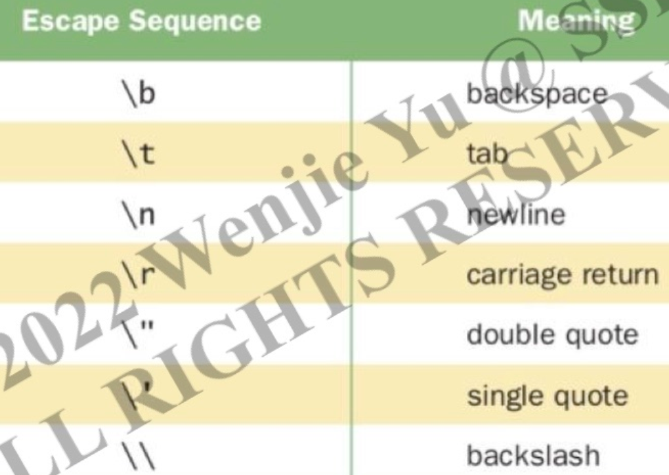

- Comment
  
  - // ： for a single current line
  
  - /*... */ : multi-lines


## - Built-in(Primitive Types)

Start with a **lower case** letter

### Types

- int:  -2^31 ~ 2^31-1

- double

- boolean

### 强转

- ```
  //Eg.
  
  int a = 1;
  double b = (double)a; 
  
  // (type) variable
  ```

### Storage

- 1 byte = 8 bits

- int : 4 bytes

- double: 8 bytes

- boolean: 1 bit

- *注意Overflow - result out of range*， 因为有storage限制 - 属于Logic Error

### Binary Number

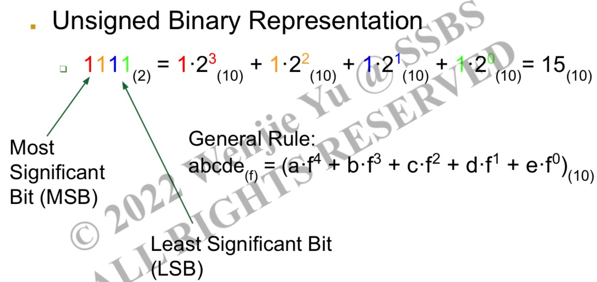

MSB: the sign of the binary number - 1(negative), 0(positive)

- **2's complement representation**
  
  - negative - 1 as the sign
    
    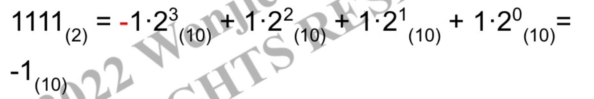


## - Variable&Constants

### Identifier

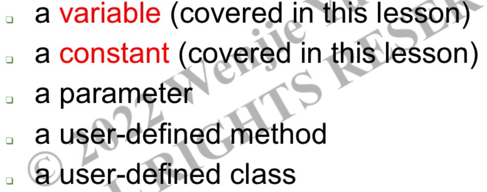

*cannot be a keyword, eg. double double = 2.3*

### Variable

Must be declared and initialized before using it

Can be changed

```java
//Eg.
int a=b=1;
a=2;
//最终：a=2, b=1 
```

### Constants

Constant name is all **CAPITLIZED**

Use the keyword **final**

```java
//Eg. 
final double PI = 3.14
```


## - Expression

### Types

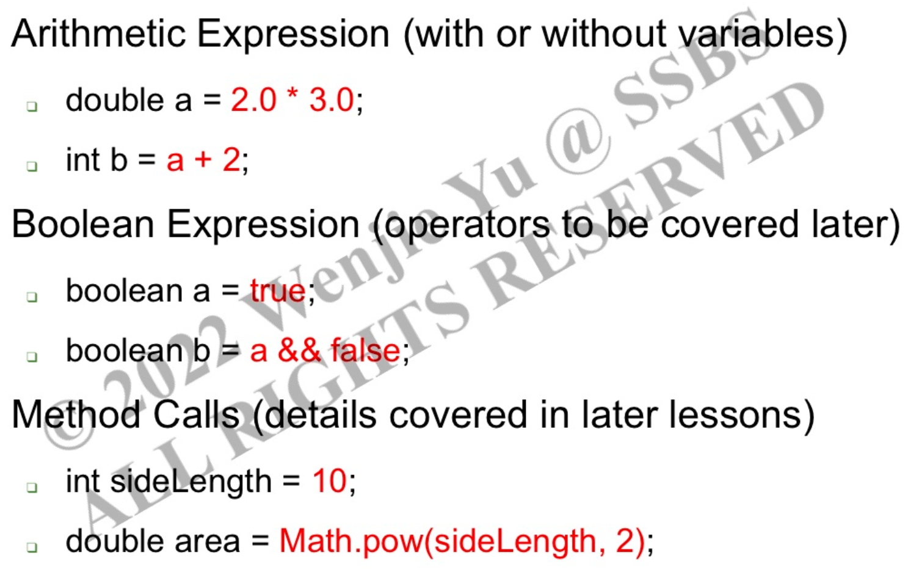

### Arthemetic Expression

| Operation       | Symbol |
|-----------------|--------|
| Addition        | +      |
| Subtraction     | -      |
| Multiplication  | *      |
| Division        | /      |
| Modulus         | %      |

*For an operation involving a double and int, int is promoted to a double*

Eg. double a = 3.5 + 2;

### Truncation - int/int
```java
int a = 1/2; // -> 0
int a = 1/2*1; // -> 0
double a = 1/2; // -> 0.0
double a = 1/2*1.0 // -> 0.0
double a = 1*1.0/2 // -> 0.5
```

### String Concatenation 

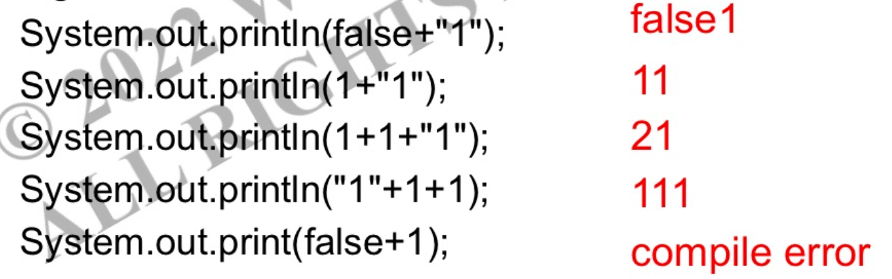

### Relational Operators

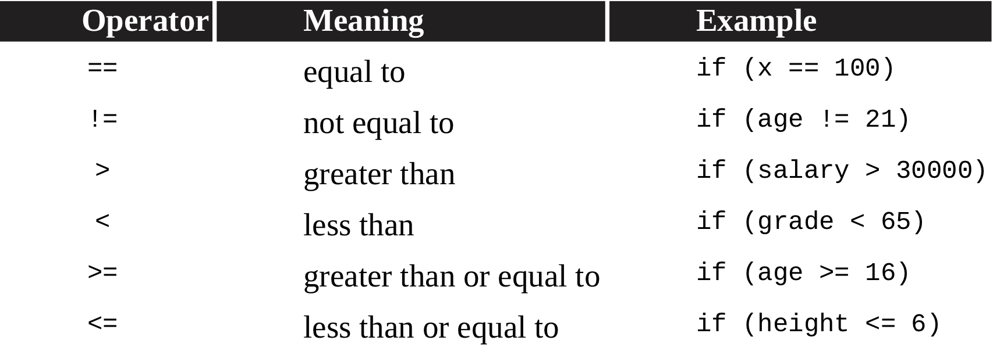

*- Only for primitive Types!*

Eg. String(object) are compared using equals() & compareTo()

*- Do not use == to test for equality of floating-point numbers! since they cannot always be represented exactly in the computer memory.*

Eg. 4.4%3 >>> 1.400000000000004

### Compound Assignment Operators

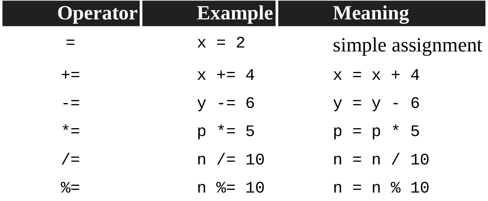

### Increment and DEcrement Operators

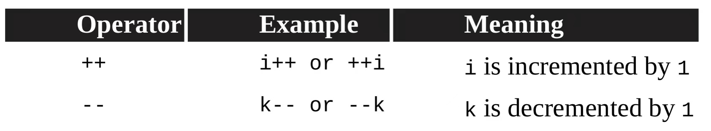

*Difference between i++ and ++i*

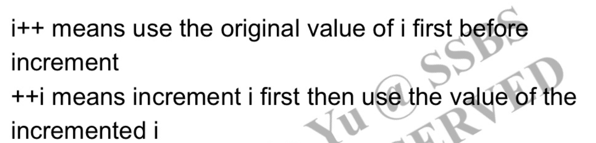

### Logical Operators

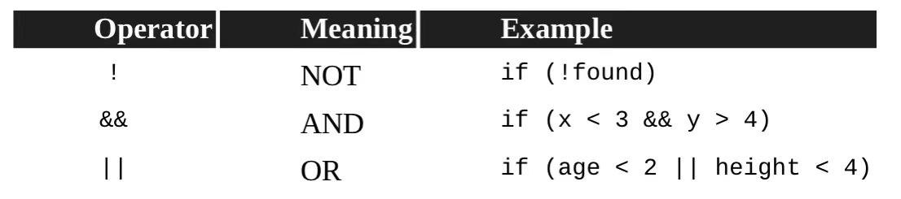

## *PRIORITY - IMPORTANT*

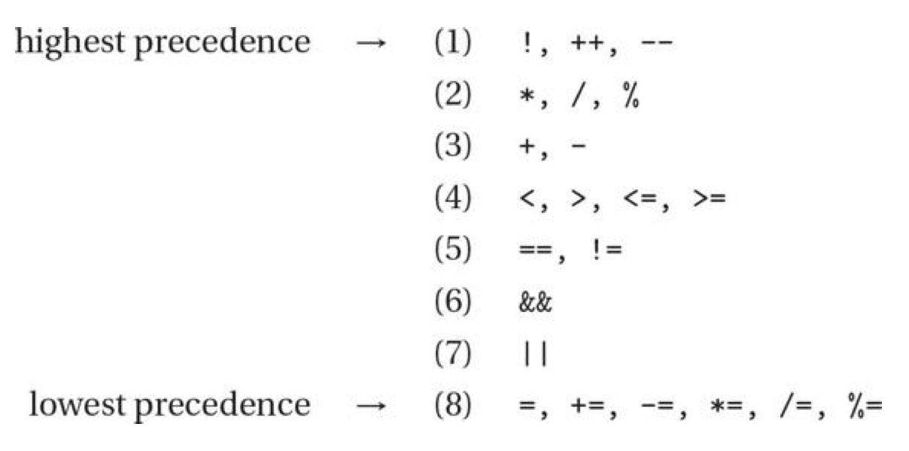

### Short Circuit

- A&&B
  
  - A为false, B不运行

- A||B
  
  - A为true, B不运行


## - De Morgan's Law

- **! ( A&&B ) = !A || !B**

- **! (A || B) = !A && !B**


## - Decision-Making Control Structures

### If Statements

```java
if(expression) // expression must have a boolean value
{
    Statement1; //executed only when expression is true
}
```

## If-else Statements

```java
if(expression)
{
    Statement1;
}
else if(expression)
{
    Statement2;
}
else
{
    Statement3;
}
```

*if后可以不加大括号{},但只能控制 if后一行的代码*

```java
int a = 0;
if(a==1)
    System.out.print(1); // S1
    System.out.print(2); // S2
//Output: 2
//因为无法进入if statement，S1无法运行；
//但S2不属于if statement,所以正常运行

if(a==0){
    System.out.print(1);
    System.out.print(2);
}
//Output: 12
```
